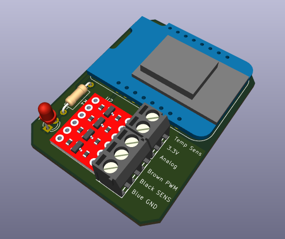
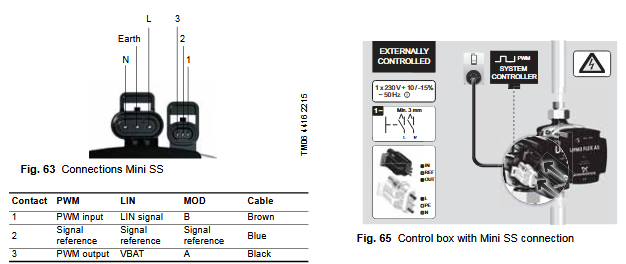
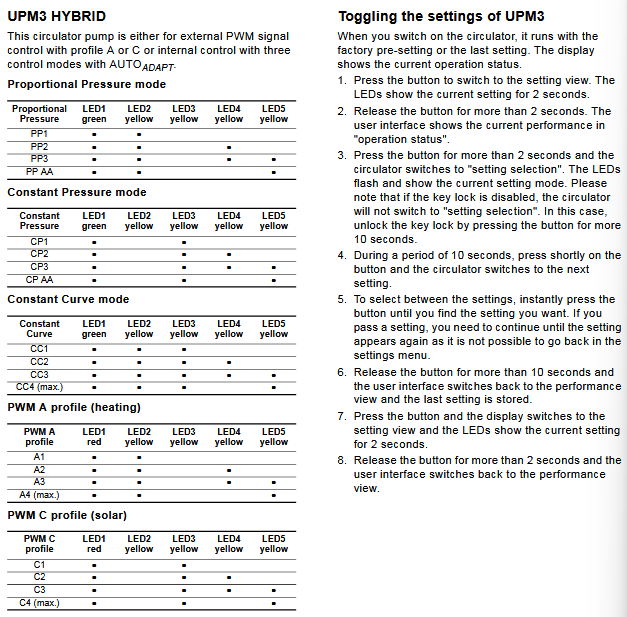
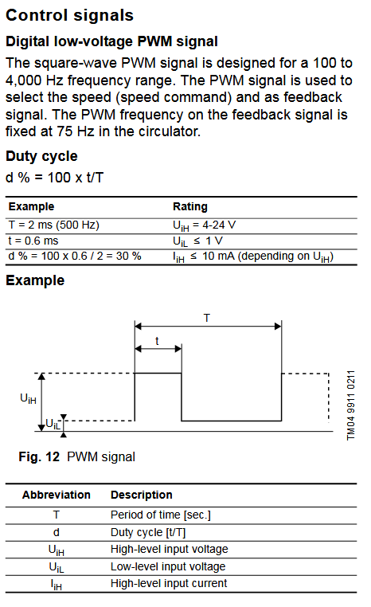

Modern heating (water)pumps can be controlled using PWM, this allows for fine-grained remote control regarding the pump speed, for integration into home automation software.

# Pump

This project is designed to work work with the following pump(s):

- Grundfos UPM3-Hybrid

Other (Grundfos) pumps may be compatible with little (software) changes, other brands may require hardware changes as well. Pull requests (even if it's just to update the list, are welcome)

# Hardware

Besides the pump, the project is built around the following hardware:

- ESP32 development board with USB (SKU: 001443)
- High speed logic level converter (SKU: 000275)
- 'Mini Superseal' cable (SKU: 6057076)
- 5V power supply for dev board
- Adapter PCB from this project*

*The PCB is optional, you can build the same layout on a breadboard or perfboard. This project is created in LibrePCB but all files required for production are included.

The ESP32 is more capable as the ESP8266 but also has built-in WiFi, allowing more room for future functionalities.
For safety and simpler schematics, 230V to 5V is done via a regular power adapter commonly used for phones.

## PCB

The PCB is  designed in KiCad, source files are available in the 'pcb/PwmPump' folder.
If you do not want to change anything but just order the PCB's from any supplier, you can use the files in 'pcb/Fabrication'.

# Software

## Features
TODO:
- [ ] Control pump speed via PWM
- [ ] Read pump speed via return signal
- [ ] External temperature sensor readout
- [ ] Easy setup via WiFi accesspoint
- [ ] Integration with Home Assistant / MQTT?
- [ ] External relay outputs for toggling zones

# Documentation / troubleshooting

Below there's some additional documentation used for troubleshooting/explanation, most is taken off the original Grundfoss manual (see sources below).

## Connections

Using the 'Mini superseal' connector, make sure the connections are as following:

## Settings

For PWM operation, the first LED should be red and the second LED should be yellow and LED 3/4/5 will show the current speed.

If the first/second LED are incorrect, refer to the steps below to change the mode of the UPM3.

## PWM Signal

From the original [Grundfoss PWM Documentation](files/Grundfosliterature-5439390.pdf):

From the documentation we can conclude that the PWM signal of the ESP32 should have the following characteristics:

- 4-24V (We will use the USB voltage, 5V through a logic level shifter)
- 100-4000 Hz range

## Feedback (return) signal

The feedback signal is 75 Hz (13 milliseconds)

If the signal is on for 95% of the time, the pump is off, anywhere within 0-70% is 0-70w or 0-140w consumption, any other percentage above 70% is an error situation, see table.

# External sources

Original project start(s) in Dutch on Tweakers.net:
- https://gathering.tweakers.net/forum/list_messages/2053330
- https://gathering.tweakers.net/forum/list_messages/1843779
- https://gathering.tweakers.net/forum/list_messages/2209694

Project by a Russian with similar purpose (however using Arduino Nano with Bluetooth):
- https://www.youtube.com/watch?v=SqCPmwxaVGU
- https://drive.google.com/drive/folders/1dqcaZ_V3Xg_vkUAnDyD56ceDHpH-dQGv

# License
 GNU Affero General Public License v3.0

 Conditions
    ⓘ Disclose source
    ⓘ License and copyright notice
    ⓘ Network use is distribution
    ⓘ Same license
    ⓘ State changes 

You should have received a copy of the GNU General Public License along with this program.  If not, see <https://www.gnu.org/licenses/>.